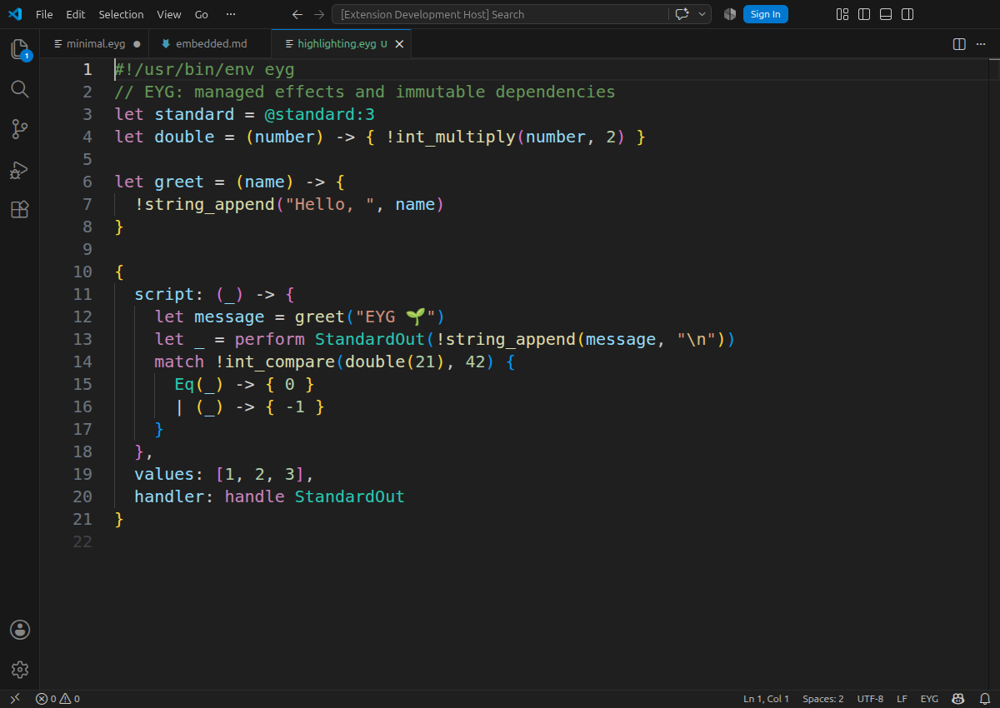

# EYG for VS Code

Syntax highlighting for the EYG language.
Includes fenced `eyg` blocks in Markdown.



## Try it

From the package root, launch VS Code with the extension loaded:
No EYG installation is required. 

```sh
code --new-window --extensionDevelopmentPath="$PWD" entry.eyg
```

### Development

For interactive development, open the package directory as a workspace, select **Run EYG Extension**, or press **F5**.
Use **Developer: Inspect Editor Tokens and Scopes** to inspect tokens.

### Package and install

From `packages/vscode-eyg`:

```sh
npm run package
code --install-extension ./eyg-0.1.0.vsix
```

To replace an installed build, add `--force` to the command and run **Developer: Reload Window**.

### Publish to the Marketplace

This extension is published via the [eyg publisher](https://marketplace.visualstudio.com/manage/publishers/eyg)

1. Choose a new version in `package.json`
2. Build the package with `npm run package`.
3. Ensure the README and screenshot are available on the repository's `main` branch.
4. Upload `eyg-<version>.vsix` through the publisher dashboard, or use the CLI:

```sh
npx vsce login eyg
npx vsce publish --packagePath ./eyg-0.1.0.vsix
```

